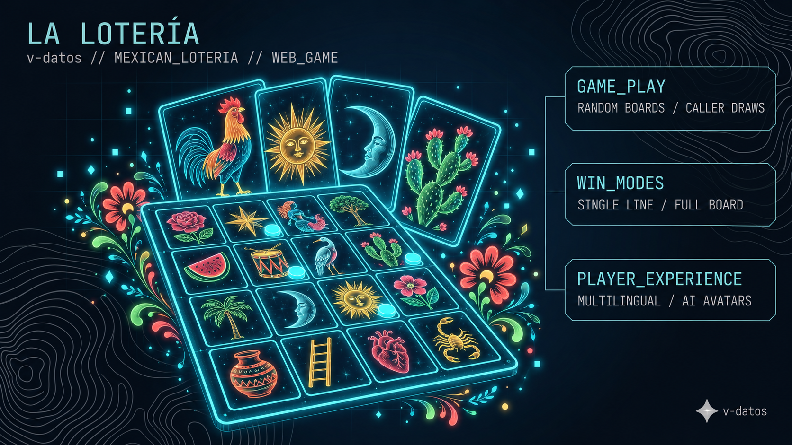

# La Lotería



A web version of Lotería, the traditional Mexican bingo-style game. Players get randomly generated cartones, a caller draws the fichas, and the game can be played for a single line or a full board. The interface is available in English, Spanish, French and Portuguese, and a Gemini-powered generator can create player avatars.

Built with Next.js 15, Tailwind CSS, shadcn/ui and Genkit. The original product spec is in [docs/blueprint.md](docs/blueprint.md).

## Getting started

Requires Node.js 20 or newer.

```bash
npm ci
npm run dev
```

The app runs at http://localhost:9002.

## Google AI key

Avatar generation calls Gemini through Genkit, which needs a Google AI API key. Get one from [Google AI Studio](https://aistudio.google.com/app/apikey) and put it in `.env.local` at the project root:

```bash
GEMINI_API_KEY=your-key-here
```

Without a key the game itself still runs; only the AI features fail.

## Other scripts

- `npm run build` builds for production.
- `npm run typecheck` runs the TypeScript compiler.
- `npm run genkit:dev` opens the Genkit developer UI for the AI flows.
